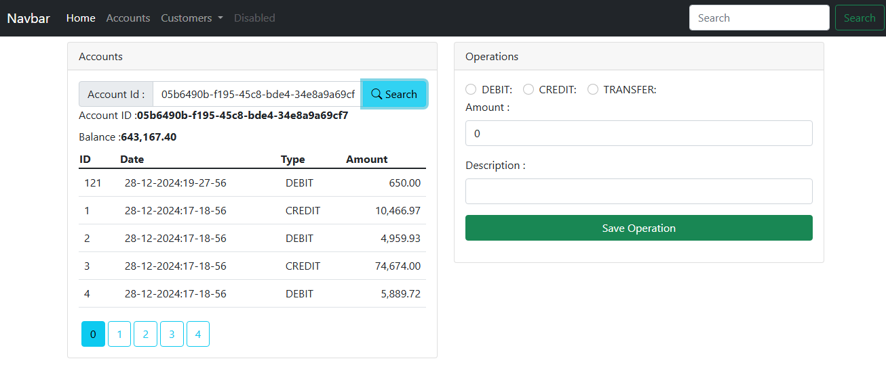
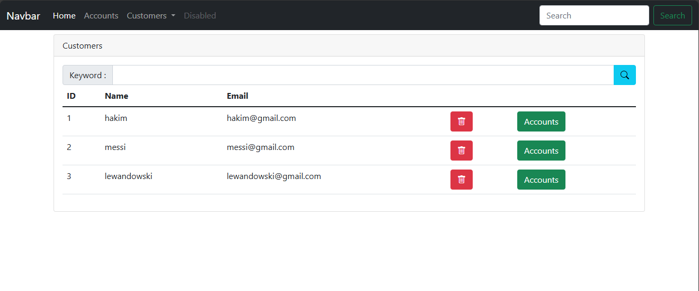
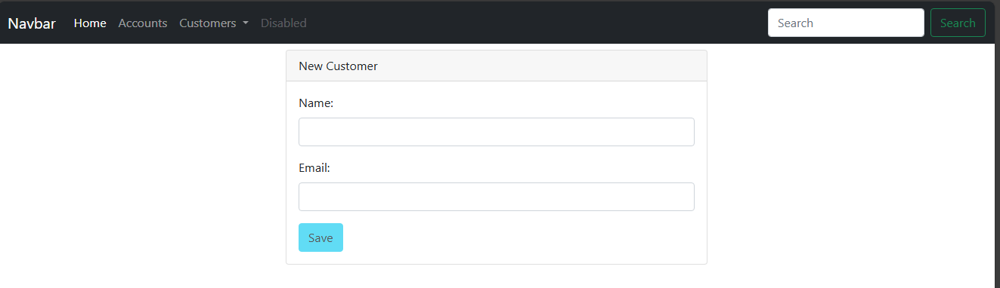

# Digital Banking Application

## 👨‍💻 Developer Info
**Hamza Taki**
- 🌐 [GitHub Profile](https://github.com/HamzaTakiX)
- 💼 Full Stack Developer
- 📫 Contact: [Hazoakaka@gmail.com]

## 🏦 Project Overview
A modern digital banking application built with Spring Boot backend and Angular frontend. This application provides a comprehensive banking experience with features for account management, transactions, and customer operations.

### 🛠️ Tech Stack
#### Backend
- Java 17
- Spring Boot 2.7.x
- Spring Data JPA
- H2 Database
- Maven
- RESTful APIs
- Exception Handling
- DTO Pattern

#### Frontend
- Angular 13+
- TypeScript
- Bootstrap 5
- Responsive Design
- Angular Material
- RxJS

## 🌟 Features

### 👥 Customer Management
- Create new customers
- View customer list
- Search customers
- Update customer information
- View customer accounts

### 💳 Account Operations
- View account details
- Search accounts by ID
- Perform credit operations
- Perform debit operations
- Transfer between accounts
- View transaction history
- Paginated operation history

### 🏦 Banking Features
- Current Account management
- Savings Account management
- Real-time balance updates
- Transaction validation
- Overdraft protection
- Interest rate calculation

## 🖼️ Screenshots

### Accounts Page

- View account details
- Perform banking operations
- Transaction history

### Customer List

- View all customers
- Search functionality
- Quick access to customer accounts

### New Customer Registration

- User-friendly form
- Input validation
- Immediate feedback

## 🚀 Getting Started

### Backend Setup
1. Navigate to the backend directory:
   ```bash
   cd backend-Digital-Banking-master
   ```
2. Build the project:
   ```bash
   mvn clean install
   ```
3. Run the application:
   ```bash
   mvn spring-boot:run
   ```
The backend will start on port 8085.

### Frontend Setup
1. Navigate to the frontend directory:
   ```bash
   cd frontend-Digital-Banking-main
   ```
2. Install dependencies:
   ```bash
   npm install
   ```
3. Run the application:
   ```bash
   ng serve
   ```
The frontend will start on port 4200.

## 📝 API Documentation

### Customer APIs
- GET `/customers`: Retrieve all customers
- POST `/customers`: Create a new customer
- GET `/customers/{id}`: Get customer by ID
- GET `/customers/{id}/accounts`: Get customer accounts

### Account APIs
- GET `/accounts/{accountId}`: Get account details
- GET `/accounts/{accountId}/operations`: Get account operations
- POST `/accounts/debit`: Perform debit operation
- POST `/accounts/credit`: Perform credit operation
- POST `/accounts/transfer`: Perform transfer operation

## 🔒 Security Features
- Input validation
- Exception handling
- Balance verification
- Transaction validation
- Secure API endpoints

## 🎯 Future Enhancements
- User authentication and authorization
- Email notifications
- Mobile responsiveness improvements
- Additional account types
- Transaction categories and analytics
- PDF statement generation

## 📄 License
This project is licensed under the MIT License - see the [LICENSE](LICENSE) file for details.

---
⭐ Don't forget to star this repository if you find it helpful!
